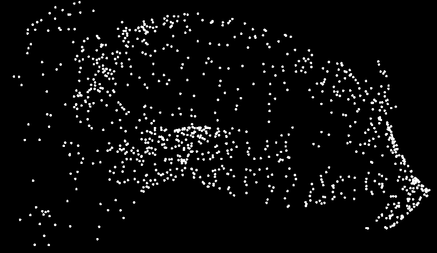

# js-swarm-sim
A conversion of my old SwarmSim project to WebGL

## About
SwarmSim is a browser-based toy in which a swarm of dots accelerate toward your cursor. Click to accelerate, release to watch them disperse.

It works great on mobile devices!

